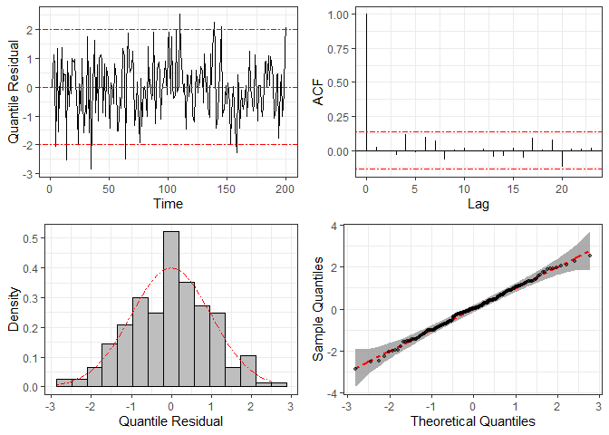
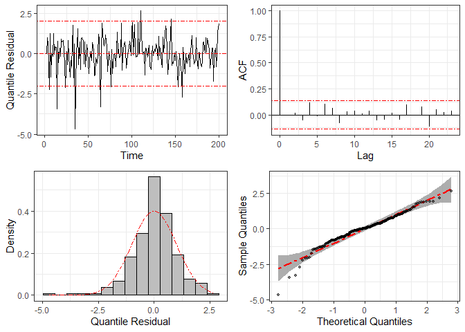

<!-- README.md is generated from README.Rmd. Please edit that file -->
<!-- badges: start -->
<!-- badges: end -->

## The `ARCensReg R` package

The `ARCensReg` package fits a univariate censored linear regression
model with autoregressive (AR) errors. The discrete-time representation
of this model for the observed response at time

is given by


where

is the response variable,

is a vector of regression parameters of dimension
,

is a vector of non-stochastic regressor variables, and

is the AR error with

representing the innovations and

denoting the vector of AR coefficients. For the innovations
,
we consider the normal or the Student-t distribution. The maximum
likelihood estimates are obtained through the Stochastic Approximation
Expectation-Maximization (SAEM) algorithm (Delyon, Lavielle, and
Moulines 1999), while the standard errors of the parameters are
approximated by the Louis method (Louis 1982). This package also
predicts future observations and supports missing values on the
dependent variable. See, for instance, (F. L. Schumacher, Lachos, and
Dey 2017) and (Valeriano et al. 2021).

For the normal model, influence diagnostic could be performed by a local
influence approach (Cook 1986) with three possible perturbation schemes:
response perturbation, scale matrix perturbation, or explanatory
variable perturbation. For more details see (Fernanda L. Schumacher et
al. 2018).

The `ARCensReg` package provides the following functions:

-   `ARCensReg`: fits a univariate censored linear regression model with
    autoregressive errors under the normal distribution.
-   `ARtCensReg`: fits a univariate censored linear regression model
    with autoregressive errors considering Student-t innovations.
-   `InfDiag`: performs influence diagnostic by a local influence
    approach with three possible perturbation schemes.
-   `rARCens`: simulates a censored response variable with
    autoregressive errors of order
    .
-   `residuals`: computes conditional and quantile residuals.

`predict`, `print`, `summary`, and `plot` functions also work for
objects given as an output of functions `ARCensReg` and `ARtCensReg`.
Function `plot` also has methods for outputs of functions `InfDiag` and
`residuals`.

Next, we will describe how to install the package and use all the
previous methods in artificial examples.

### Installation

The released version of `ARCensReg` from
[CRAN](https://CRAN.R-project.org) can be installed with:

``` r
install.packages("ARCensReg")
```

And the development version from [GitHub](https://github.com/) with:

``` r
# install.packages("devtools")
devtools::install_github("fernandalschumacher/ARCensReg")
```

### Examples

**Example 1**. We simulated a dataset of length

from the autoregressive model of order

with normal innovations and left censoring.

``` r
library(ARCensReg)
library(ggplot2)

set.seed(12341)
n = 100
x = cbind(1, runif(n))
dat = rARCens(n=n, beta=c(1,-1), phi=c(.48,-0.4), sig2=.5, x=x,
              cens='left', pcens=.05, innov="norm")

ggplot(dat$data, aes(x=1:n, y=y)) + geom_line() + labs(x="Time") + theme_bw() +
  geom_line(aes(x=1:n, y=ucl), color="red", linetype="dashed")
```


Supposing the AR order is unknown, we fit a censored linear regression
model with Gaussian AR errors of order

and
,
and the information criteria are compared.

``` r
fit1 = ARCensReg(dat$data$cc, dat$data$lcl, dat$data$ucl, dat$data$y, x, 
                 p=1, pc=0.15, show_se=FALSE, quiet=TRUE)
fit1$critFin 
#>         Loglik     AIC     BIC AICcorr
#> Value -113.027 234.054 244.475 234.475

fit2 = ARCensReg(dat$data$cc, dat$data$lcl, dat$data$ucl, dat$data$y, x, 
                 p=2, pc=0.15, quiet=TRUE)
fit2$critFin
#>         Loglik     AIC     BIC AICcorr
#> Value -105.279 220.558 233.583 221.196
```

Based on the information criteria AIC and BIC, the model with AR errors
of order

is the best fit for this data. The parameter estimates and standard
errors can be visualized through functions `summary` and `print`.

``` r
summary(fit2)
#> ---------------------------------------------------
#>   Censored Linear Regression Model with AR Errors 
#> ---------------------------------------------------
#> Call:
#> ARCensReg(cc = dat$data$cc, lcl = dat$data$lcl, ucl = dat$data$ucl, 
#>     y = dat$data$y, x = x, p = 2, pc = 0.15, quiet = TRUE)
#> 
#> Estimated parameters:
#>       beta0   beta1 sigma2   phi1    phi2
#>      1.0830 -1.0965 0.4713 0.4690 -0.3883
#> s.e. 0.1465  0.2389 0.0689 0.0949  0.0941
#> 
#> Model selection criteria:
#>         Loglik     AIC     BIC AICcorr
#> Value -105.279 220.558 233.583 221.196
#> 
#> Details:
#> Type of censoring: left 
#> Number of missing values: 0 
#> Convergence reached?:  
#> Iterations: 168 / 400 
#> MC sample: 10 
#> Cut point: 0.15 
#> Processing time: 1.698037 mins
```

Moreover, for censored data, the convergence plot of the parameter
estimates can be displayed through function `plot`.

``` r
plot(fit2)
```


Now, we perturb the observation

by making it equal to 6 and then fit a censored linear regression model
with Gaussian AR errors of order
.

``` r
y2 = dat$data$y
y2[81] = 6
fit3 = ARCensReg(dat$data$cc, dat$data$lcl, dat$data$ucl, y2, x, p=2,
                 show_se=FALSE, quiet=TRUE)
fit3$tab
#>   beta0   beta1 sigma2   phi1    phi2
#>  1.1702 -1.2065 0.7237 0.3812 -0.3355
```

It is worth noting that the parameter estimates were affected because of
the perturbation. Thence, we can perform influence diagnostic to
identify influential points which may cause unwanted effects on
estimation and goodness of fit. In the following analysis, we only
consider the response perturbation scheme, where we deduced that
observations

to

may be influential.

``` r
M0y = InfDiag(fit3, k=3.5, perturbation="y")
#> Perturbation scheme: y 
#> Benchmark: 0.059 
#> Detected points: 80 81 82
plot(M0y)
```


**Example 2**. A dataset of size

is simulated from the censored regression model with Student-t
innovations and right censoring. To fit this data, we can use the
function `ARtCensReg`, but it is worth mentioning that this function
only works for response vectors with the first

values wholly observed.

``` r
set.seed(783796)
n = 200
x = cbind(1, runif(n))
dat2 = rARCens(n=n, beta=c(2,1), phi=c(.48,-.2), sig2=.5, x=x, cens='right',
               pcens=.05, innov='t', nu=3)
head(dat2$data)
#>           y cc      lcl ucl
#> 1 3.3242078  0 4.284143 Inf
#> 2 2.9409784  0 4.284143 Inf
#> 3 3.5386525  0 4.284143 Inf
#> 4 3.4107191  0 4.284143 Inf
#> 5 0.3564079  0 4.284143 Inf
#> 6 2.6332103  0 4.284143 Inf
```

For models with Student-t innovations, the degrees of freedom can be
provided through argument `nufix` when it is known, or the algorithm
will estimate it when it is not provided, i.e., `nufix=NULL`.

``` r
# Fitting the model with nu known
fit1 = ARtCensReg(dat2$data$cc, dat2$data$lcl, dat2$data$ucl, dat2$data$y, x,
                  p=2, M=20, nufix=3, quiet=TRUE)
fit1$tab
#>       beta0  beta1 sigma2   phi1    phi2
#>      1.9707 0.9594 0.4468 0.3778 -0.1562
#> s.e. 0.1230 0.1890 0.0640 0.0572  0.0590

# Fitting the model with nu unknown
fit2 = ARtCensReg(dat2$data$cc, dat2$data$lcl, dat2$data$ucl, dat2$data$y, x,
                  p=2, M=20, quiet=TRUE)
fit2$tab
#>       beta0  beta1 sigma2   phi1    phi2     nu
#>      1.9630 0.9720 0.4812 0.3798 -0.1563 3.4760
#> s.e. 0.1266 0.1953 0.0991 0.0592  0.0606 1.1295
```

Note that the parameter estimates obtained from both models are close,
and the estimate of

was close to the true value
().

To check the statistical model’s specification, we can use graphical
methods based on the quantile residuals, which are computed through
function `residuals` and plotted by function `plot`.

``` r
res = residuals(fit2)
plot(res)
```



For comparison, we fit the same dataset considering the normal
distribution (i.e., disregarding the heavy tails) and compute the
corresponding quantile residuals. The resulting plots are given below,
where we can see clear signs of non-normality, such as large residuals
and some points outside the confidence band in the Q-Q plots.

``` r
fit3 = ARCensReg(dat2$data$cc, dat2$data$lcl, dat2$data$ucl, dat2$data$y, x,
                 p=2, M=20, show_se=FALSE, quiet=TRUE)
plot(residuals(fit3))
```



### References

<div id="refs" class="references csl-bib-body hanging-indent">

<div id="ref-cook1986assessment" class="csl-entry">

Cook, R. D. 1986. “Assessment of Local Influence.” *Journal of the Royal
Statistical Society: Series B (Methodological)* 48 (2): 133–55.

</div>

<div id="ref-delyon1999convergence" class="csl-entry">

Delyon, B., M. Lavielle, and E. Moulines. 1999. “Convergence of a
Stochastic Approximation Version of the EM Algorithm.” *Annals of
Statistics*, 94–128.

</div>

<div id="ref-louis1982finding" class="csl-entry">

Louis, Thomas A. 1982. “Finding the Observed Information Matrix When
Using the EM Algorithm.” *Journal of the Royal Statistical Society:
Series B (Methodological)* 44 (2): 226–33.

</div>

<div id="ref-schumacher2017censored" class="csl-entry">

Schumacher, F. L., V. H. Lachos, and D. K. Dey. 2017. “Censored
Regression Models with Autoregressive Errors: A Likelihood-Based
Perspective.” *Canadian Journal of Statistics* 45 (4): 375–92.

</div>

<div id="ref-schumacher2018influence" class="csl-entry">

Schumacher, Fernanda L, Victor H Lachos, Filidor E Vilca-Labra, and Luis
M Castro. 2018. “Influence Diagnostics for Censored Regression Models
with Autoregressive Errors.” *Australian & New Zealand Journal of
Statistics* 60 (2): 209–29.

</div>

<div id="ref-valeriano2021censored" class="csl-entry">

Valeriano, K. L., F. L. Schumacher, C. E. Galarza, and L. A. Matos.
2021. “Censored Autoregressive Regression Models with
Student-
Innovations.” *arXiv Preprint arXiv:2110.00224*.

</div>

</div>
